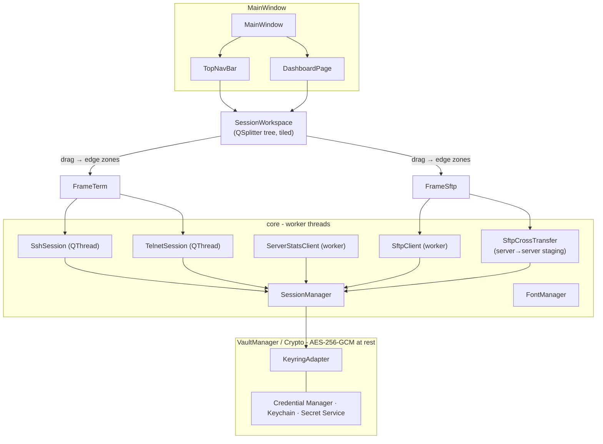

<p align="center">
  
</p>

<h1 align="center">clientosh</h1>

<p align="center">
  <b>A lightweight multiplatform SSH, SFTP, Telnet, RDP, and serial console client with a split-pane terminal - made for people who live on the command line.</b>
</p>

<p align="center">
  Terminal, SFTP, and Telnet live side-by-side in a <b>single window</b>. Drag, split, dock, detach. Zero fuss, real connections.
</p>

<br/>

<p align="center">
  <a href="https://github.com/hdmain/clientosh/releases"></a>
  
  
  
  
</p>

<p align="center">
  
  
  
  
  
  
  
</p>

---

<br/>

## 📸 &nbsp;Showcase

<p align="center"></p>
<p align="center"><em>Drag a session chip onto another pane and watch the live split-preview - then drop into any edge.</em></p>

<p align="center"></p>
<p align="center"><em>The dashboard - your launchpad for every session.</em></p>

<p align="center"></p>
<p align="center"><em>A live terminal pane with scrollback, keyword highlighting, and the dark monospace look.</em></p>

<p align="center"></p>
<p align="center"><em>Two terminals tiled in one window - no separate OS windows to juggle.</em></p>

<p align="center"></p>
<p align="center"><em>Terminal and SFTP file manager docked side-by-side for the same session.</em></p>

<br/>

---

## ✨ &nbsp;Key Features

- **🪶 Lightweight & native** - idles at roughly **~30 MB RAM**, because clientosh is written native against **Qt 6 widgets in C++** - no Electron, no bundled Chromium, no JVM. It launches in a blink and stays out of your memory even with many panes open.
- **🧱 Split-pane workspace, single window** - drag a session chip onto a live pane to preview the viewport, then drop onto a `Left` / `Right` / `Top` / `Bottom` zone to dock. Terminal **and** SFTP panes share one OS window with animated, eased splitter morphing.
- **🔒 Layer-0 secure vault** - session metadata and secrets are encrypted at rest with **AES-256-GCM** (OpenSSL EVP), backed by your OS keyring: **Windows Credential Manager, macOS Keychain, and Secret Service (libsecret)** - with a machine-bound encrypted-file fallback that keeps things working headless.
- **🗝️ Central SSH key management** - use your **SSH agent**, import reusable keys into the encrypted vault, or select a key file. Stored keys have OpenSSH-compatible SHA-256 fingerprints, per-key passphrases, and usage protection. Decrypted payloads are **zeroed in memory** after use.
- **📡 Telnet terminal** - connect to Telnet hosts (port 23) with NAWS resize support, alongside SSH sessions in the same workspace.
- **🖥️ RDP remote desktop** - embedded **FreeRDP** client in the workspace pane: enter credentials in-app, desktop renders inside clientosh (no external `mstsc` / `xfreerdp` window).
- **🔌 Serial / COM terminal** - connect directly to local serial devices with configurable baud rate, data bits, parity, stop bits, and hardware/software flow control. Connected serial terminals can send recovery images through XMODEM with checksum/CRC-16 negotiation, retry handling, progress, and cancellation.
- **⚡ Non-blocking threading model** - SSH auth, shell I/O, SFTP, and live stats all run on **worker threads**; the GUI never freezes on connect or auth.
- **🖥️ Hand-rolled VT100/xterm emulator** - full scrollback buffer, 256-color + true SGR attributes, alt-screen, mouse reporting & tracking, box-drawing glyphs, DEC character sets, and live keyword/address highlighting - all in pure Qt widgets.
- **📁 Bundled SFTP file manager** - browse, upload, download, and delete remote files for the active session, with details/compact views.
- **🔀 Server-to-server SFTP transfer** - move files **directly between two remote hosts** through a temporary staging area, with per-file progress, verbose logging, and an atomic cancel that cleans up after itself.
- **🌐 Proxy routing** - optional HTTP, SOCKS4, or SOCKS5 proxy for SSH, SFTP, and general HTTP traffic (updates, fonts, addon catalog). GitHub Gist sync always bypasses the proxy and connects directly.
- **📊 Live server stats** - per-session CPU / RAM / disk readouts pushed over a dedicated SSH channel on a configurable interval.
- **🪟 Detach & re-attach** - pull a terminal out into its own viewport, then dock it right back into the workspace.
- **🎨 Raw dark UI with motion** - flat, high-contrast monospace theme with subtle eased glows and hover fills (`src/ui/Motion`), plus a light theme, adjustable fonts, and optional blurred background images.
- **🔧 Channel-aware builds** - the product version in `project(...)` is combined with an explicit `dev`, `beta`, or `stable` build channel and flows through About, Windows resources, installers, and package metadata.
- **🧩 Addon marketplace** - browse and install optional addons from a remote catalog (Settings → Addons); nothing loads until you install and enable it.

<br/>

---

## 🧩 &nbsp;Addons

Optional plugins are downloaded from the catalog in this repository:

[`addons/index.json`](https://raw.githubusercontent.com/hdmain/clientosh/main/addons/index.json)

In the app: **Settings → Addons → Refresh catalog → Install**.

| Addon | Description |
|---|---|
| **AI agent** | OpenAI-compatible side panel agent: streaming think, Markdown chat, multi-step shell commands with confirmation (read-only commands auto-run), terminal observation loop. Configure API base / model under **Settings → AI agent** after install. |

Plugins are Qt `MODULE` libraries loaded with `QPluginLoader` only while installed and enabled — uninstalled addons use no extra RAM.

> 💡 **What makes clientosh "fast"?** It's a **native Qt 6 / C++** app - no Electron or web-view overhead - so it's snappy to launch and sips about **~30 MB RAM**. Network I/O never touches the UI thread, the vault decrypts near-instantly via an in-memory machine-bound key (no keyring/DPAPI latency at launch), and animations are vsync-paced with no continuous timers while idle.

<br/>

---

## 🧰 &nbsp;Tech Stack & Architecture

<p align="center">
  
  
  
  
  
  
</p>

| Layer | Technology |
|---|---|
| **Language** | C++17 |
| **UI toolkit** | Qt 6 (`Widgets`, `Network`, `Svg`) |
| **SSH / SFTP / Telnet / RDP / Serial** | libssh 2.x (SSH/SFTP) · native Telnet (Qt Network) · **FreeRDP** (embedded RDP) · native COM/TTY transport |
| **Cryptography** | OpenSSL EVP - AES-256-GCM authenticated encryption |
| **Keyring** | Windows Credential Manager · macOS Keychain · Secret Service (`secret-tool`) |
| **Build system** | CMake ≥ 3.21 + Ninja / Unix Makefiles / MinGW Makefiles |
| **Packaging** | CPack (deb/rpm) · Inno Setup · NSIS · dockerized Arch makepkg · AppImage · dmg |
| **CI / CD** | GitHub Actions (matrix: Ubuntu, macOS, Windows-MSYS2), release on `v*` tags |

<br/>



**Threading model** - every network concern (auth, shell I/O, SFTP, stats polling) runs on a dedicated worker thread. The GUI thread issues commands and consumes queued signals; it never blocks on a socket.

**Security model** - two encrypted files:
- `connects.json` (fast metadata) is locked with an **in-memory machine-bound key** (SHA-256 of machine-id + per-user scope) for near-instant launch.
- `dbvault` (passwords · passphrases · imported keys) is AES-256-GCM encrypted under a random 256-bit master key persisted in the **OS keyring**, with a graceful file fallback. Both are written **atomically** (temp file + rename) so a crash can never corrupt them.

<br/>

---

## 🚀 &nbsp;Quick Start & Installation

### Requirements

- CMake **≥ 3.21**
- A **C++17** compiler (GCC, Clang, MinGW, or MSVC)
- Qt **6** (`Widgets`, `Network`, `Svg`)
- **libssh** 2.x
- OpenSSL **3** (for the encrypted vault)

### Install dependencies

<details>
<summary><b>🪟 Windows - MSYS2 (MinGW / UCRT64)</b></summary>

```bash
pacman -S mingw-w64-x86_64-gcc mingw-w64-x86_64-cmake \
  mingw-w64-x86_64-qt6-base mingw-w64-x86_64-qt6-svg \
  mingw-w64-x86_64-libssh mingw-w64-x86_64-openssl mingw-w64-x86_64-freerdp
```

Or build against an existing pinned Qt install (see *Windows build* below).
</details>

<details>
<summary><b>🐧 Debian / Ubuntu / WSL</b></summary>

```bash
sudo apt install build-essential cmake pkg-config \
  qt6-base-dev libqt6svg6-dev libssh-dev libssl-dev freerdp3-dev
```
</details>

<details>
<summary><b>🐧 Fedora</b></summary>

```bash
sudo dnf install cmake gcc-c++ qt6-qtbase-devel qt6-qtsvg-devel libssh-devel openssl-devel freerdp-devel
```
</details>

<details>
<summary><b>🍎 macOS - Homebrew</b></summary>

```bash
brew install cmake qt libssh openssl@3 freerdp pkg-config
```
</details>

### Building

> ⚠️ **Important:** use a **separate build directory per platform**. Reusing a Windows `build/` from WSL (or the reverse) fails because CMake caches generators and paths differ.

**Linux / WSL / macOS**

```bash
cmake -S . -B build-linux -G "Unix Makefiles" -DCMAKE_BUILD_TYPE=Release
cmake --build build-linux -j"$(nproc 2>/dev/null || sysctl -n hw.ncpu || echo 4)"
./build-linux/clientosh
```

An ordinary source build reports `<version>-dev`. Official rolling beta and
stable builds set the channel in CI; to reproduce a beta identity locally use:

```bash
cmake -S . -B build-beta -DCLIENTOSH_BUILD_CHANNEL=beta -DCLIENTOSH_BUILD_NUMBER=1
```

If CMake cannot find Qt, point it at the Qt6 include tree:

```bash
cmake -S . -B build-linux -DCMAKE_PREFIX_PATH=/usr   # Debian/Ubuntu (usually /usr)
# or, for a manual Qt build:
cmake -S . -B build-linux -DCMAKE_PREFIX_PATH=/path/to/Qt/6.x/gcc_64
```

**🪟 Windows - Qt + MinGW (pinned Qt 6.9.2)** - the recommended path is the CMake preset, which pins the build to **exactly Qt 6.9.2** plus its matching **MinGW 13.1.0** toolchain and libssh/OpenSSL from MSYS2 - the same set the release CI uses, so the app renders and behaves identically to the released build.

```powershell
cmake --preset windows-qt692-mingw   # Qt 6.9.2 + MinGW 13.1, outputs to build-win/
cmake --build  --preset windows-qt692-mingw
.\build-win\clientosh.exe

# Optional: repackage the installer after a rebuild
& "C:\Program Files (x86)\Inno Setup 6\ISCC.exe" build-win\installer\clientosh_installer.iss
```

> 💡 Build from a shell where the Qt toolchain `bin` is on `PATH`
> (`C:/Qt/Tools/mingw1310_64/bin`); the preset injects it automatically. The Windows build also runs `windeployqt --release` and copies the runtime DLLs (libssh, OpenSSL, MinGW) so the exe is **self-contained**.

### Install the packaged release

| Platform | Artifacts |
|---|---|
| **Linux** | `.deb`, `.rpm`, `.AppImage`, portable `.tar.gz` |
| **Windows** | Inno Setup `.exe`, portable `.zip` |
| **Arch** | `.pkg.tar.zst` |
| **macOS** | `.dmg` |

```bash
# Linux - .deb
./scripts/build-deb.sh
sudo apt install ./build-deb/clientosh_*.deb

# Reproduce a beta package (About: 1.0.8-beta.1)
CLIENTOSH_BUILD_CHANNEL=beta CLIENTOSH_BUILD_NUMBER=1 ./scripts/build-deb.sh

# Build a stable RPM
CLIENTOSH_BUILD_CHANNEL=stable ./scripts/build-rpm.sh
```

Both packaging scripts default to the `dev` channel. Supported values for
`CLIENTOSH_BUILD_CHANNEL` are `dev`, `beta`, and `stable`; `beta` additionally
requires a positive numeric `CLIENTOSH_BUILD_NUMBER`.

<br/>

---

## 🎬 &nbsp;Usage & Examples

### 1. Add a session

From the dashboard, create an **SSH** (terminal + SFTP), **Telnet** (terminal only), **SFTP-only**, **RDP** (embedded remote desktop), or **Serial / COM** session. RDP opens a pane with user/domain/password fields and renders the Windows desktop inside clientosh via FreeRDP.

Open connections also appear under **Hosts → Current sessions**. Use the `+` action there, or right-click a session tab and choose **Save connection profile**, to keep an ad-hoc session as a reusable host.

You can also open an ad-hoc terminal session directly from the command line. The tab name is optional; both `-n` and `--name` are accepted:

```bash
/usr/bin/clientosh telnet 192.0.2.10:23 --name router
/usr/bin/clientosh ssh 192.0.2.20:22 --name server
/usr/bin/clientosh rdp admin@win.example.com --name windows
/usr/bin/clientosh serial COM3 --baud 115200 --name console
/usr/bin/clientosh serial /dev/ttyUSB0 --baud 9600 --name console
```

If the endpoint matches a saved profile of the same type, its credentials and key settings are reused. Otherwise SSH uses the default username configured in clientosh settings.
When clientosh is already running, subsequent SSH/Telnet/RDP/serial commands add another tab to the existing window instead of starting another window.

> By default, saved credentials are *rejected* unless you explicitly opt in to store a password - secrets live only in the encrypted keyring vault, never in plaintext.

### 2. Connect

Choose one explicit authentication method: **SSH agent**, a key from **SSH Keys**, a private-key file, or a password. Methods do not silently fall back to one another. Password authentication may use keyboard-interactive when the server disables plain password auth.

### 3. Split panes

Drag a session chip onto another pane, hover to preview the split, then drop onto the **Left / Right / Top / Bottom** zone. The splitter animates into place.

To undo a split without disconnecting, drag the pane header or its session chip back onto the top tab bar. You can also click the pane-header close button while it is split; the live session returns to a normal tab.
Right-click a session tab to place it on the left, right, top, or bottom of another session using the **Split screen** submenu.

For Cisco-heavy workflows, enable **Settings → Appearance / UI → Colorize Cisco CLI insights**. It highlights interface names, port and adjacency states, routing/L2 protocols, IOS syslog severities, configuration prompts, and common faults such as `err-disabled`, CRC errors, drops, and timeouts.

### 4. SFTP

Click the folder icon in the top bar to open the file manager for the active session - browse, upload, download, and delete remote files. Dock it beside the terminal for a single-pane workflow.

### 5. Cross-server transfer

When two SFTP sessions are open, move files **between servers** without ever touching your disk's real tree:

```text
[ Server A : /var/www ]  ──download──▶  [ staging/ ]  ──upload──▶  [ Server B : /srv ]
        (worker thread)       per-file progress          (recursive, cancellable)
```

<details>
<summary><b>🔍 Verbose cross-transfer log output</b></summary>

```
[xfer 12:01:03.112] xfer: 3 entries from prod-db -> staging-box:22 staging=…/clientosh_xfer_1
[xfer 12:01:04.001] xfer: file 'backup.sql' isDir=false
[xfer 12:01:05.220] xfer: file 'uploads' isDir=true
[xfer 12:01:05.224] xfer: download failed for 'uploads' err=NO_SUCH_PATH (22) - path not found
[finished] transferred backup.sql
```

Enable verbose mode with **Settings → SFTP → verbose logging**.
</details>

### 6. Proxy

Open the **Proxy** tab in the sidebar (between Logs and Settings) to route network traffic through a corporate or local proxy.

| Field | Description |
|---|---|
| **Enable proxy** | Master toggle; when off, all connections go direct |
| **Protocol** | `HTTP`, `SOCKS4`, or `SOCKS5` |
| **Host / Port** | Proxy server address (default port suggestion: `8080`) |
| **Authentication** | Optional username and password (password stored in the OS keyring, not the INI file) |

When enabled:

- **SSH / SFTP** sessions tunnel through the proxy via a manual SOCKS/HTTP CONNECT handshake, then hand the socket to libssh.
- **HTTP clients** (release checks, font downloads, addon catalog) use `QNetworkProxy::setApplicationProxy()`.
- **GitHub Gist sync** always uses a direct connection (`QNetworkProxy::NoProxy`) regardless of this setting.

Changes apply immediately as you edit the fields; reconnect open sessions to pick up a new proxy configuration.

### Keyboard shortcuts (all remappable)

| Action | Default |
|---|---|
| New session | `Ctrl+N` |
| Settings | `Ctrl+,` |
| Dashboard | `Ctrl+Shift+D` |
| Close panel | `Ctrl+W` |
| Open SFTP | `Ctrl+Shift+S` |
| Clear active terminal | `Ctrl+Shift+K` |
| Font bigger / smaller / reset | `Ctrl+=` / `Ctrl+-` / `Ctrl+0` |

### Command-line interface

`clientosh` can be launched from the terminal to open a session immediately or to print help/version. With no arguments it opens the dashboard GUI.

```text
clientosh [options] <command> <target>
```

| Command | Description | Default port |
|---|---|---|
| `ssh` / `connect` | SSH terminal (+ optional SFTP with `--sftp`) | 22 |
| `telnet` | Telnet terminal | 23 |
| `sftp` | SFTP file manager only | 22 |
| `serial` / `com` | Local Serial/COM terminal | — |
| `rdp` / `desktop` | Embedded RDP desktop (FreeRDP) | 3389 |

**Target** (required for connect commands): `host`, `host:port`, `user@host`, `user@host:port`, IPv6 `[::1]:port`, or a serial device such as `COM3` or `/dev/ttyUSB0`.

#### Help and version

These print to the terminal and exit — no GUI window:

```bash
clientosh --help
clientosh -h
clientosh --version
clientosh -v
```

On Windows, run from **PowerShell** or **cmd** (for example `.\build\clientosh.exe --help`).

#### Quick connect examples

```bash
# Telnet
clientosh telnet 192.168.0.1:23 --name Router
clientosh telnet switch.local -u admin --name Core-SW

# SSH
clientosh ssh user@prod.example.com --name Production
clientosh ssh 10.0.0.5:2222 -u admin --name Jump
clientosh ssh host -i ~/.ssh/id_ed25519 -u root --name Root
clientosh ssh user@host -p secret --name Lab

# SSH + SFTP pane at once
clientosh ssh deploy@files.example.com --sftp --name Deploy

# SFTP only
clientosh sftp user@files.example.com --name Files
clientosh sftp backup.local:2222 -u backup --name Backups

# Serial / COM
clientosh serial COM3 --baud 115200 --name Console
clientosh serial /dev/ttyUSB0 --baud 9600 --name Console

# RDP (embedded FreeRDP client in the workspace pane)
clientosh rdp admin@win-server.example.com --name Windows
clientosh rdp user@10.0.0.50:3389 -p secret --domain CORP --name DC

# Windows (path to built binary)
.\build\clientosh.exe telnet 192.168.0.1:23 --name Router
.\build\clientosh.exe ssh user@10.0.0.5 --name Prod

# Linux / macOS (installed binary)
clientosh telnet router.lan:23 --name Router
/usr/bin/clientosh ssh user@prod.example.com --name Production
```

Connect commands open the **GUI** and start the session in a new tab. Use `-n` / `--name` to set the tab title. Passwords from `-p` / `--password` are used for this session only and are **not** saved to the vault.

For Telnet, username is optional (you can type credentials manually in the terminal). Serial sessions do not use authentication. RDP uses password auth only; enter credentials in the RDP pane before connecting. For SSH and SFTP, provide `user@host` or `-u` / `--user`.

#### Options

| Option | Description |
|---|---|
| `-n`, `--name` | Tab / pane title |
| `-u`, `--user` | Username (overrides `user@` in target) |
| `-P`, `--port` | Port (overrides `:port` in target) |
| `-p`, `--password` | Password for this session only (not saved) |
| `-i`, `--identity` | Private key file path |
| `--agent` | Authenticate using SSH agent |
| `--stored-key`, `--keyring` | Stored SSH key id (`--keyring` is the legacy alias) |
| `--key-passphrase` | Passphrase for an encrypted private key |
| `--sftp` | With `ssh`, also open an SFTP pane |
| `--baud` | Serial baud rate (default: 115200) |
| `--domain` | Windows domain for RDP sessions |
| `--verbose` | Verbose SFTP logging (same as Settings → SFTP) |
| `-h`, `--help`, `-?` | Print usage and exit |
| `-v`, `--version` | Print version and exit |

<br/>

---

## ⚙️ &nbsp;Configuration

Settings are persisted as an INI file via Qt's `QSettings` (e.g. `%APPDATA%/clientosh/clientosh.ini` on Windows, `~/.config/clientosh/clientosh.ini` on Linux). **Passwords and key passphrases are never stored there** — they live only in the encrypted vault (`dbvault`). Any leftover legacy plaintext profile entries are migrated into the vault and wiped on startup.

| Key | Type | Default | Description |
|---|---|---|---|
| `settings/theme` | `string` | `dark` | `dark` or `light` UI theme |
| `settings/fontSize` | `int` | `11` | Terminal font size in points (9–22) |
| `settings/fontFamily` | `string` | *(auto)* | Monospace terminal face (empty = auto-pick) |
| `settings/terminalFg` / `terminalBg` | `string` | per theme | Terminal foreground / background colors |
| `settings/terminalBgImage` | `string` | - | Optional blurred background image |
| `settings/terminalBgOpacity` / `terminalBgBlur` | `qreal` / `int` | `0.5` / `0` | Background image opacity / blur radius |
| `settings/animationsEnabled` | `bool` | `true` | UI motion + ease transitions |
| `settings/savePasswordDefault` | `bool` | `false` | Default "save password" for new sessions |
| `settings/hideDotfiles` | `bool` | `true` | Hide dotfiles in SFTP browser |
| `settings/statsIntervalSec` | `int` | `2` | Live server-stats polling interval (1–30 s) |
| `settings/showServerStats` | `bool` | `true` | Show CPU / RAM / disk readouts |
| `settings/sftpDefaultView` | `string` | `details` | SFTP view: `details` or `compact` |
| `settings/sftpVerboseLogging` | `bool` | `false` | Verbose cross-transfer logs |
| `settings/highlightAddresses` | `bool` | `true` | Highlight IP/addresses in terminal |
| `settings/highlightLogKeywords` | `bool` | `true` | Highlight log keywords in terminal |
| `settings/ctrlScrollFontZoom` | `bool` | `true` | `Ctrl` + scroll zooms the font |
| `settings/defaultHost` / `defaultUser` / `defaultPort` | - | `127.0.0.1` / - / `22` | Prefill for the new-session dialog |
| `settings/proxyEnabled` | `bool` | `false` | Route SSH/SFTP and HTTP through a proxy |
| `settings/proxyProtocol` | `int` | `2` (SOCKS5) | `0` = HTTP, `1` = SOCKS4, `2` = SOCKS5 |
| `settings/proxyHost` | `string` | - | Proxy hostname or IP |
| `settings/proxyPort` | `int` | `8080` | Proxy port (1–65535) |
| `settings/proxyAuthEnabled` | `bool` | `false` | Send proxy username/password |
| `settings/proxyUsername` | `string` | - | Proxy username (password in keyring) |
| `shortcut*` | `string` | see table | Every shortcut + its enable flag |

<br/>

---

## 🗺️ &nbsp;Roadmap

- [x] Split-pane terminal workspace (drag → edge dock)
- [x] OS-keyring-backed encrypted vault + key import
- [x] Hand-rolled VT100/xterm emulator
- [x] Bundled SFTP file manager
- [x] Server-to-server SFTP transfers
- [x] Live server stats polling
- [x] Dark & light themes, fonts, background images
- [x] Cross-distro packaging (deb / rpm / AppImage / Arch / dmg / Inno / NSIS)
- [x] Telnet terminal sessions
- [x] RDP remote desktop (embedded FreeRDP client)
- [x] Password auth with keyboard-interactive fallback
- [x] Addon marketplace (install from catalog)
- [x] AI agent addon (OpenAI-compatible terminal agent)
- [x] Client-side proxy routing (HTTP / SOCKS4 / SOCKS5; Gist sync bypass)
- [ ] **Host-key verification** (see security note below)
- [ ] SSH agent forwarding / SOCKS proxy / TCP forwarding
- [ ] Multi-host broadcast / scripted command sender
- [ ] Portable (green) session export/import

<br/>

---

## 🤝 &nbsp;Contributing

Contributions are welcome! Please:

1. **Fork** [hdmain/clientosh](https://github.com/hdmain/clientosh).
2. Create a feature branch (`git checkout -b feat/my-change`).
3. Keep builds clean on **Linux, macOS, and Windows**.
4. Open a **pull request** against `main`.

The **CI** workflow builds and smoke-tests the project on Ubuntu, macOS, and Windows (MSYS2) for every push and PR. The **Beta** and **Release** workflows use the same packaging pipeline for Windows, Linux, Arch Linux, and macOS. Every push to `main` replaces the rolling beta, while a `v*` tag creates a stable release - each with checksums.

> 🔐 **Security note:** host-key checking is intentionally disabled to keep the local client raw and friction-free. Prefer running clientosh on **trusted networks** until key verification (the top roadmap item) lands.

> 💡 **Pro tip:** bump the numeric product version once in `project(VERSION ...)`. CMake then adds the selected build channel consistently to About, Windows resources, installers, and Linux package metadata.

<br/>

---

## ⬇️ &nbsp;Download beta versions

Pre-release builds from the latest commit on `main`. The [beta release](https://github.com/hdmain/clientosh/releases/tag/beta) is updated automatically on every push.

| Platform | Download |
|---|---|
| **Windows** (64-bit installer) | [clientosh-beta-win64-setup.exe](https://github.com/hdmain/clientosh/releases/download/beta/clientosh-beta-win64-setup.exe) |
| **Windows** (64-bit portable) | [clientosh-beta-win64-portable.zip](https://github.com/hdmain/clientosh/releases/download/beta/clientosh-beta-win64-portable.zip) |
| **Linux** (Debian / Ubuntu `.deb`) | [clientosh-beta-amd64.deb](https://github.com/hdmain/clientosh/releases/download/beta/clientosh-beta-amd64.deb) |
| **Linux** (Fedora / RHEL / openSUSE `.rpm`) | [clientosh-beta-x86_64.rpm](https://github.com/hdmain/clientosh/releases/download/beta/clientosh-beta-x86_64.rpm) |
| **Linux** (`.AppImage`) | [clientosh-beta-x86_64.AppImage](https://github.com/hdmain/clientosh/releases/download/beta/clientosh-beta-x86_64.AppImage) |
| **Linux** (portable `.tar.gz`) | [clientosh-beta-linux-x86_64.tar.gz](https://github.com/hdmain/clientosh/releases/download/beta/clientosh-beta-linux-x86_64.tar.gz) |
| **Arch Linux** (`.pkg.tar.zst`) | [clientosh-beta-x86_64.pkg.tar.zst](https://github.com/hdmain/clientosh/releases/download/beta/clientosh-beta-x86_64.pkg.tar.zst) |
| **macOS** (`.dmg`) | [clientosh-beta-macos.dmg](https://github.com/hdmain/clientosh/releases/download/beta/clientosh-beta-macos.dmg) |
| **Checksums** | [CHECKSUMS-beta.txt](https://github.com/hdmain/clientosh/releases/download/beta/CHECKSUMS-beta.txt) |

```bash
# Linux
sudo apt install ./clientosh-beta-amd64.deb
```

For stable, tagged releases see [Releases](https://github.com/hdmain/clientosh/releases).

<br/>

---

## 📄 &nbsp;License

Released under the [MIT License](LICENSE). © 2026 clientosh contributors.
